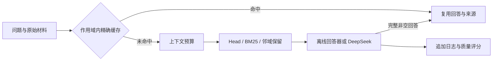
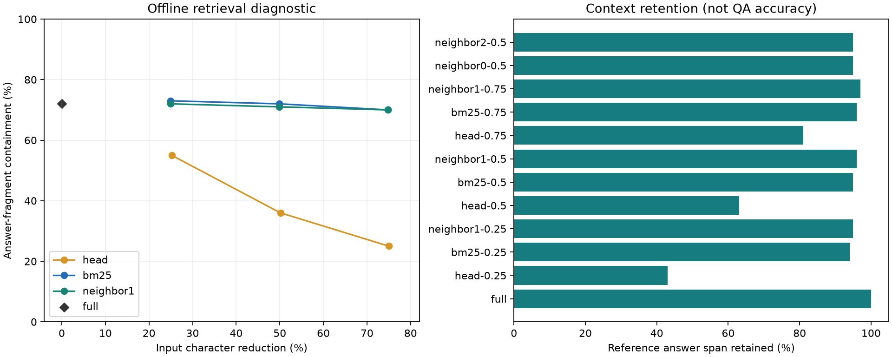
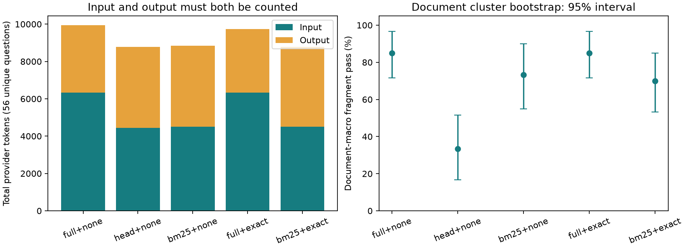

# Token Budget Lab

[](https://github.com/Wuuuucccyyy/Token-budget-lab/actions/workflows/test.yml)

本项目以文档问答的任务准确率为首要目标，评估上下文筛选与回答缓存能否在满足质量要求的前提下降低 token 消耗，并改善端到端速度。实现包括 BM25 句子检索、邻域保留、精确/词面缓存，以及可恢复的 DeepSeek 实验流程。

当前包含 **74 条合成请求的真实 API 实验**，以及 **480 道公开数据问答、其中 100 道测试题 × 12 组配置的离线对照**。两类实验分别报告，字符节省不冒充模型 token 节省，句子检索指标不冒充大模型准确率。

## 快速运行

Python 3.10+；默认路径仅依赖标准库，无需 GPU 或 API Key。

```bash
python -m unittest discover -s tests -v
python scripts/reproduce.py --output local_results/public-reproduce
```

生成运行清单、逐请求日志、汇总、失败案例与待填写的人工复核表。需要图表时先安装 `requirements-analysis.txt`，再在复现命令末尾加 `--plots`。合成数据的原始入口仍为 `python -m token_budget_lab --output local_results/synthetic`。

## 方法与处理流程

评估依次检查：**任务质量 → token 消耗 → 端到端速度**。速度与 token 都是重要效率指标，但节省开销不能抵消答错问题。真实短答案任务先报告 EM/F1 与人工复核，再对满足质量要求的配置比较输入、输出和耗时；离线片段命中只作为诊断指标。

默认允许主质量指标下降为 0。新汇总采用同题配对、按材料聚类的差值区间进行筛查；区间跨越门槛时结论为不确定。该筛查限定于当前材料和自动评分，不能替代人工正确性检查，也不保证绝对准确率达到应用要求。



| 方法 | 选择依据 | 当前局限 |
|---|---|---|
| Full | 保留全部上下文 | 输入较长 |
| Head | 按原文顺序保留整句 | 容易丢失后部证据 |
| BM25 | 根据问题与句子的词项匹配排序 | 不充分处理同义词、指代与推理 |
| BM25 + 邻域 | 高分锚句附近的句子优先占用预算 | 可能挤掉远处证据；不保证改善 |
| 精确缓存 | 相同问题、材料、范围与配置 | 收益取决于重复比例 |
| 词面近似缓存 | 词项余弦相似度 | 仅在合成实验中研究，存在否定与数字误命中 |
| LLMLingua-2 post-fit | 可选学习式压缩及外层预算裁剪 | 已提供入口，尚未运行权重推理 |

半径 0 的邻域方法与 BM25 等价，半径 1、2 用于消融。所有评分标注仅在推理结束后使用。字符预算包含拼接换行，系统指令和问题保持完整。

## 公开数据与离线结果

数据来源为 SQuAD v1.1 的公开开发集：将同篇文章的段落组合成较长材料，每篇随机抽取 10 题，共 48 篇、480 题。文章长度约 1.5 万至 8.6 万字符。按文章隔离为 280/100/100 题。来源、固定版本、改编与许可见 [数据说明](data/PUBLIC_DATA.md)。

这是本项目的 SQuAD 文章级派生任务，不是官方榜单成绩，也不是 LongBench 复现。当前测试覆盖 12 个固定设置，不据测试结果选择最优参数。

| 策略（50% 字符预算） | 离线答案片段包含率 | 答案原文保留率 |
|---|---:|---:|
| Full | 72% | 100% |
| Head | 36% | 63% |
| BM25 | 72% | 95% |
| BM25 + 邻域半径 1 | 71% | 96% |

邻域方法多保留了一部分答案原文，但没有提升这轮离线回答指标。离线回答器返回相关句子，尚不能说明 DeepSeek 在这些材料上的表现。



完整表格、EM/F1、材料簇区间及逐题数值见 [公开数据报告](results/public/REPORT.md)、[统计摘要](results/public/summary.json) 和 [失败案例](results/public/FAILURE_CASES.md)。原始回答与上下文可通过固定配置重新生成。

## 已有 DeepSeek 实测

2026-10-09 的实验覆盖 74 条人工构造请求、20 份材料。去除 18 条精确重复后，BM25 的答案片段通过率从 87.5% 降到 78.6%；当前结果不足以支持其满足准确率优先的要求。输入总量从 6,339 降到 4,495 token（减少 29.1%），输出 token 同时从 3,605 增到 4,346。这些效率收益需放在质量损失的前提下理解。

计入重复请求的系统级比较中，BM25 + 精确缓存相对 Full 将调用从 74 次降到 56 次，输入 token 减少 46.4%。这个数字同时包含检索与缓存收益。



设置、材料簇置信区间以及一次未计量请求的限制见 [DeepSeek 报告](results/DEEPSEEK_EXPANDED_REPORT.md)。公开 CSV 可通过 `analysis.py` 重算，完整私有调用日志不进入仓库。

已有日志的端到端 P50/P95，以及缓存命中与未命中的分别耗时，见 [速度复核](results/latency/DEEPSEEK_LATENCY.md)。历史实验仅运行一轮且策略顺序固定，不能据此认定某方法稳定更快。新版请求计时包含缓存查询、上下文筛选和生成，排除评测与日志写入；尚未测首 token 延迟、并发吞吐量和模型冷启动。

## 新版真实实验入口

在本机设置 `DEEPSEEK_API_KEY`，不把密钥写入仓库或聊天。PowerShell 可使用遮蔽输入：

```powershell
$deepseekSecret = Read-Host 'DeepSeek API Key' -AsSecureString
$env:DEEPSEEK_API_KEY = [System.Net.NetworkCredential]::new('', $deepseekSecret).Password
Remove-Variable deepseekSecret
```

将 `configs/deepseek_pilot.json` 的模型占位符改为账户可用模型 ID。先检查计划，再实际调用：

```bash
python -m token_budget_lab.experiment --config configs/deepseek_pilot.json --dry-run
python -m token_budget_lab.experiment --config configs/deepseek_pilot.json --output local_results/deepseek-public
```

计划从 10 篇开发集文章各取 1 题、比较 4 种方法，最多 40 次调用。真实运行产生费用；上限约束调用次数而不是金额。默认关闭思考模式、最多输出 512 token；与历史实验设置不同。

新流程保存数据/代码指纹、API 协议与思考设置、输入/输出 usage、压缩耗时、端到端 P50/P95、空答及截断。短答案试验统一使用相同回答格式指令，并以 EM 为主质量指标、F1 为补充。`--resume` 跳过已完成请求；可能已付费但状态不明的请求不会自动重发。新版公开数据 API 调用与 LLMLingua-2 权重实验尚未执行，详见 [实验协议](docs/EXPERIMENTS.md)。

## 本地交互演示

```bash
python -m token_budget_lab.demo
```

浏览器打开 `http://127.0.0.1:8765`，输入问题与材料，切换方法和保留比例，查看被选中的句子、发送内容与字符预算。页面仅运行本地压缩。

## 代码与文档

| 路径 | 职责 |
|---|---|
| `core.py` | 分句、BM25、邻域预算与缓存 |
| `datasets.py` / `metrics.py` | 数据加载、参考答案与 EM/F1 |
| `experiment.py` / `deepseek.py` | 配置化运行、日志恢复、API 协议 |
| `analysis.py` / `failures.py` | 聚类统计、图表、失败案例与复核表 |
| `configs/` / `scripts/` | 固定实验设置、数据重建、一键复现 |
| `tests/` | 预算边界、隔离、划分、恢复与模拟 API 测试 |

进一步说明：[实现说明](docs/CODE_WALKTHROUGH.md) · [技术背景与阅读路线](docs/LEARNING_GUIDE.md) · [研究计划](docs/RESEARCH_PLAN.md) · [实验协议](docs/EXPERIMENTS.md)。

## 来源、许可与研究边界

参考 [GPTCache](https://github.com/zilliztech/GPTCache)、[LLMLingua](https://github.com/microsoft/LLMLingua)、[Selective Context](https://aclanthology.org/2023.emnlp-main.391/) 与 [LongBench](https://github.com/THUDM/LongBench)。当前没有同条件复现 GPTCache / LLMLingua，不声称优于这些系统。

代码采用 [MIT](LICENSE)，合成数据为原创虚构资料；SQuAD 数据与改编按 [CC BY-SA 4.0](data/PUBLIC_DATA.md) 使用。字符数与实际模型 token、答案字符串与语义正确性、同文档问题与独立样本均分别处理。后续重点是公开数据的真实生成评测、匹配实际 token 预算、盲评与多轮运行。
