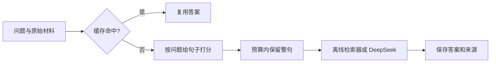

# Token Budget Lab

一个面向本科生的 Python 实验项目：**先查回答缓存，再按问题筛选上下文，观察输入开销与回答质量的取舍。**

不需要 GPU；离线版本不需要安装依赖。提供 DeepSeek 真实 API 实验入口。
这是借鉴 GPTCache 和 LLMLingua 思路的教学基线，不是论文复现，也没有证明优于它们。
初版代码和文档由 AI 辅助生成，适合在理解、核查和扩展后用于课题组交流。

## 先运行

需要 Python 3.10 或更新版本。在项目根目录打开终端：

```bash
python -m unittest discover -s tests -v
python -m token_budget_lab
```

查看 [生成的实验报告](results/REPORT.md)，逐条结果在 `results/results.json`。
默认使用 **字符数**，不是模型 token 数；离线回答器只返回相关句子，不会调用大模型。

## 这个项目研究什么

给定问题和一段材料，我们能否只发送相关内容，同时复用已回答的问题？

例如材料既包含食堂位置，也包含图书馆开放时间。问题是“图书馆周日开放吗”，
就优先保留图书馆的相关句子。再次收到同一问题时，如果材料、用户范围和模型配置没变，直接返回缓存答案。



| 模块 | 实现 | 需要知道的局限 |
|---|---|---|
| 上下文筛选 | BM25 句子相关性排序，在预算内保留整句 | 看词语重合，不能充分理解同义词、代词和多步推理 |
| 精确缓存 | 问题逐字相同；范围包含原始材料、用户、模型、提示词及压缩配置 | 进程内存缓存，程序退出就清空；无法捕获外部世界变化 |
| 近似缓存实验 | 中文字/双字片段及英文词的余弦相似度 | 是词面相似度，不是 embedding 语义缓存；可能误命中 |
| 离线评测 | 原文证据保留、答案片段包含、错误缓存复用 | 74 条人工教学请求、20 份材料、38 个事实标签；不是独立真实数据集 |
| DeepSeek 评测 | 真实 `usage`、输入/输出 token、服务端缓存 token、耗时 | 真实调用结果单独保存，不含密钥 |

## 已运行的离线实验

74 条请求、20 组配置，包括重复问题、改写、数字差异、否定、材料更新和多句证据。
样例来自 20 份人工编写的虚构材料；有意安排的重复与改写只用于学习缓存，不是独立样本。
Python 3.11.9 下通过 20 项单元测试。GitHub Actions 配置了 3.10 / 3.11 / 3.12，远端运行状态以 Actions 页面为准。

离线字符统计在保留比例 50% 时，BM25 + 精确缓存相对完整输入：

- 模拟调用数从 74 次降到 56 次。
- 拟发送输入**字符数**减少 52.2%。
- 全部证据保留率 90.5%；离线句子检索器的答案片段包含率 87.8%。
- 精确缓存 18 次命中，按样例标签统计错误复用为 0。

相同比例、词面相似度阈值 0.70 时，29 次命中有 8 次错误复用。
这个例子说明不能只追求“节省最多”。上述数字依赖这套人工数据；**不是 DeepSeek 实测 token 节省或准确率**。

## 扩展样本的 DeepSeek 实验

另有一次真实 API 实验：74 条请求、20 份虚构材料；主质量分析排除 18 条精确重复，按 56 个非重复问题计算，并按材料做聚类 bootstrap。BM25 对非重复问题减少 29.1% 输入 token，答案片段通过率从 87.5% 降至 78.6%。完整结果、置信区间和局限见 [DeepSeek 扩展实验报告](results/DEEPSEEK_EXPANDED_REPORT.md)。

此实验是教学样例上的初步观察，不是独立真实数据集评测；报告公开汇总数据和逐题 token/评分字段，不公开逐条生成答案。离线字符实验与真实 API token 实验是不同测量，不能混为一谈。

## 用 DeepSeek 做真实实验

先在 DeepSeek 平台创建 API Key。仅在本机设置 `DEEPSEEK_API_KEY`，不要写进仓库。
PowerShell 可用遮蔽输入方式设置当前终端的环境变量，避免把密钥写进命令历史：

```powershell
$deepseekSecret = Read-Host 'DeepSeek API Key' -AsSecureString
$env:DEEPSEEK_API_KEY = [System.Net.NetworkCredential]::new('', $deepseekSecret).Password
Remove-Variable deepseekSecret
```

在下列命令中，把占位符换成你账户当前可用的模型 ID：

```bash
python -m token_budget_lab.deepseek --model YOUR_AVAILABLE_MODEL_ID --limit 4 --max-tokens 256
```

此命令会真实发送数据并产生 API 费用。默认对前 4 条请求运行 5 种策略，最多 20 次调用；精确缓存命中会减少调用。
先小样本验证，再用 `--limit 74` 运行完整教学集。模型名以 [DeepSeek 官方文档](https://api-docs.deepseek.com/en/) 和你的账户为准，不硬编码旧模型名。

输出写入被 Git 忽略的 `local_results/时间戳/`：

- `requests.jsonl`：逐请求回答、选中的原文、真实 usage、截断标记和耗时。
- `summary.json`：各策略输入 token、输出 token、输入 token 减少比例等。

统计以 API 返回的 `prompt_tokens` / `completion_tokens` 为准。服务端前缀缓存命中仍有输入 token，也可能有费用；不能把它当成本项目“完全不调用模型”的回答缓存。
参见 [DeepSeek usage 定义](https://api-docs.deepseek.com/api/create-chat-completion/)。

真实实验当前按**字符比例**选择上下文，再测量 API 的实际 token；不是 DeepSeek 精确 token 上限控制。
结果包含提示词模板及服务商实际计数。脚本不自动重试；失败后保留已完成调用的记录并标记 `incomplete`。
无法获知的失败请求费用不会被编造为 0。需要重新运行时使用新输出目录。

`max_tokens` 较小时可能截断答案，尤其是思考模型；查看 `finish_reason` 和 `truncated_answers`。
API 默认采样行为依模型而定，一次结果不能代表稳定效果。需要重复运行、随机化策略顺序后比较质量和延迟。
答案片段包含率只是自动筛查，还需人工检查“开放/不开放”等相反含义。

## 可选：用指定 tokenizer 统计 token

```bash
python -m pip install -r requirements-tokenizer.txt
python -m token_budget_lab --encoding cl100k_base --output local_results/tokenizer-demo
```

首次使用可能下载词表。此时报告单位变为 `tokens`，但 `cl100k_base` 不是 DeepSeek 的 tokenizer，不能用它推算 DeepSeek 账单。
交付时由于下载网络不可用，未运行这条可选分词器路径；默认字符路径及 DeepSeek 模拟接口已测试。

## 文件阅读顺序

1. [学习路线](docs/LEARNING_GUIDE.md)：读哪些资料、每篇掌握什么、每天做什么。
2. [代码讲解](docs/CODE_WALKTHROUGH.md)：从问题输入跟到结果输出。
3. `token_budget_lab/core.py`：分句、BM25、预算选择、缓存。
4. `token_budget_lab/benchmark.py`：对照实验、评价指标、报告。
5. `token_budget_lab/deepseek.py`：真实 API 实验和 usage。
6. [向老师介绍项目](docs/RESEARCH_PLAN.md)：已完成内容、局限与下一步。

## 如何扩展

- 用验证集选择预算和近似缓存阈值，测试集按文档隔离，避免重复资料泄漏。
- 加入 embedding 语义缓存，并测试近似问题误命中。
- 加入 LLMLingua-2 压缩基线；比较相同输入 token 预算下的问答质量，而不只比较相同名义压缩率。
- 引入跨句证据、否定、数字和指代样例；记录失败案例。
- 数据规模扩大后可换为 SQLite 缓存、TTL 和显式知识库版本；当前版本的线性遍历仅供教学。

## 来源与致谢

代码独立实现，没有复制下列项目源码。思想与阅读参考：

- [GPTCache](https://github.com/zilliztech/GPTCache)
- [LLMLingua / LongLLMLingua / LLMLingua-2](https://github.com/microsoft/LLMLingua)
- [rank_bm25](https://github.com/dorianbrown/rank_bm25)
- [Selective Context 论文](https://aclanthology.org/2023.emnlp-main.391/)
- [Prompt Compression Survey](https://aclanthology.org/2025.naacl-long.368/)
- [LongBench](https://github.com/THUDM/LongBench)

代码采用 [MIT License](LICENSE)。人工样例为项目原创的虚构校园资料。
